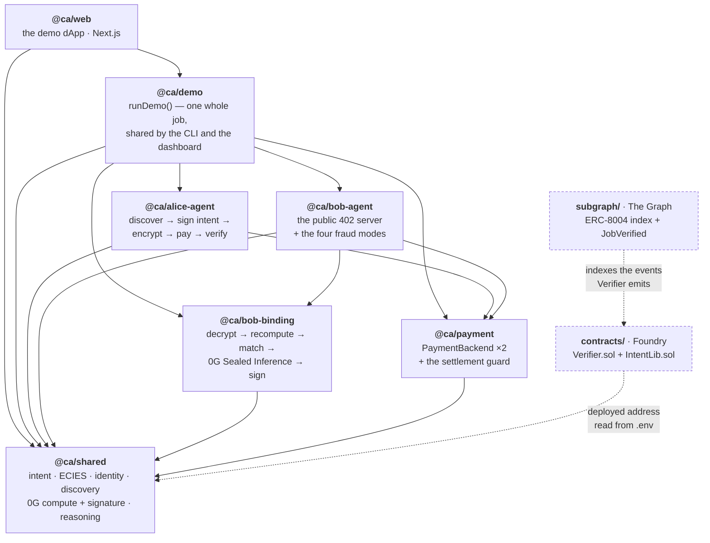
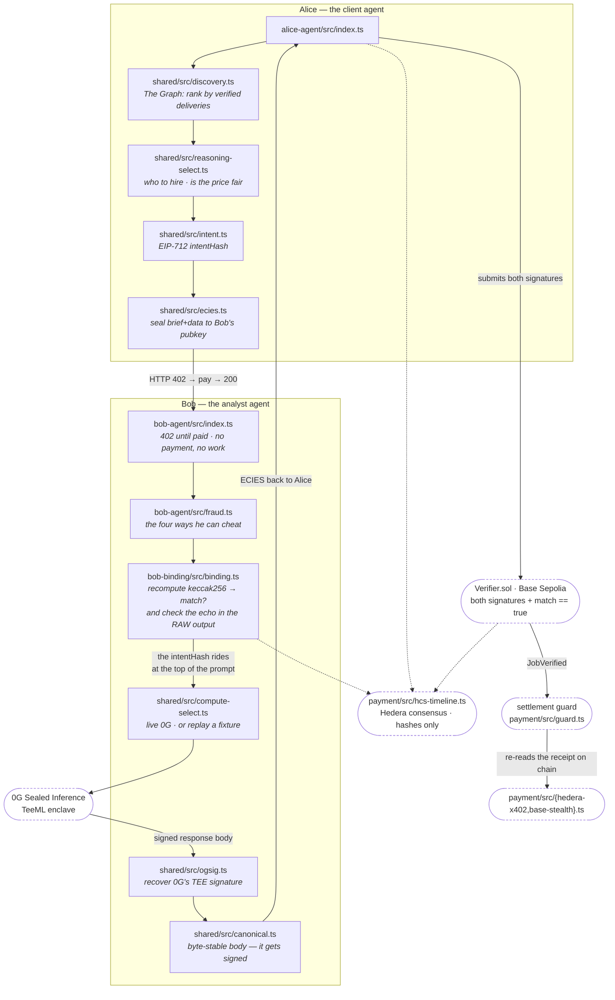

# Confidential Agents — ETHGlobal Lisbon 2026

Two independent AI agents — **Alice** (client) and **Bob** (expert analyst) — discover each other
through a public **ERC-8004** registry, then keep the whole relationship private: what was said,
who was paid, and the work itself. The result is verifiable on-chain, and it is provably *the job
Alice ordered*.

**The thesis.** Payment, execution and reputation are each solved for agents; nothing connects
them. We carry **one signed intent hash** from the payment, through the enclave, into the verdict
— *intent-bound verification*. 0G attests the compute; we attest the intent.

**Tracks:** 0G · The Graph · Hedera. 100% testnet.

| | |
|---|---|
| 0G track write-up | [`docs/0g.md`](./docs/0g.md) |
| The Graph track write-up | [`docs/the-graph.md`](./docs/the-graph.md) |
| Hedera track write-up | [`docs/hedera.md`](./docs/hedera.md) |
| Full spec & build plan | [`CLAUDE.md`](./CLAUDE.md) · [`BUILD-PLAN.md`](./BUILD-PLAN.md) |
| Verifier contract (Base Sepolia) | [`0x3B116D648B710f551e37223c4c4d39879AFEEb96`](https://sepolia.basescan.org/address/0x3B116D648B710f551e37223c4c4d39879AFEEb96) |
| 0G Sealed Inference provider (Galileo, chainId 16602) | [`0xa48f01287233509FD694a22Bf840225062E67836`](https://chainscan-galileo.0g.ai/address/0xa48f01287233509FD694a22Bf840225062E67836) · model `qwen/qwen2.5-omni-7b` · `TeeML` |
| Job timeline topic (Hedera) | [`0.0.9738448`](https://hashscan.io/testnet/topic/0.0.9738448) |
| Subgraph (The Graph Studio) | `confidential-agents` v0.0.3 — [query it yourself](./docs/the-graph.md#1-query-it-yourself-open-this-first) |
| ERC-8004 agent ids | Bob `8429` · Alice `8431` on [`0x8004A818BFB912233c491871b3d84c89A494BD9e`](https://sepolia.basescan.org/address/0x8004A818BFB912233c491871b3d84c89A494BD9e) |

---

## What actually runs

A job goes end to end across four networks, each doing exactly one thing:

**Base = the verdict · Hedera = the money and the timeline · The Graph = the read layer · 0G = the compute.**

```
Alice (client agent)                                Bob (analyst agent)
  discover via The Graph          ── HTTP 402 ──▶     no payment → 402, and NO WORK
  LLM brain picks Bob                                 quote: price, asset, payee
  LLM brain approves the price
  sign EIP-712 intent             ── ECIES ────▶     decrypt {intentHash, brief, data}
  authorize x402 (no money moves)                     recompute keccak256 → match?
                                                      run the model in 0G Sealed Inference
                                                      verify 0G's TEE signature
  verify + decrypt result         ◀── ECIES ────      sign {intentHash, outputHash, match}

  Verifier.sol (Base Sepolia): recover Bob's binding signature + Alice's EIP-712 intent,
  require match == true  →  emit JobVerified

  Bob calls /settle with the JobVerified tx  →  the x402 authorisation is submitted on Hedera.
  A rejected job never reaches this line, and the signed authorisation is never submitted.

  Every stage is committed to a Hedera Consensus Service topic — hashes only, never content.
```

Measured end-to-end latency, 5 runs, no payment rail: **p50 21.0 s, p95 22.7 s** against a 60 s
budget (`fixtures/latency/P0-G.json`, reproduce with `pnpm measure:e2e`). The dominant term is the
0G inference call, ~12.4 s.

### The fraud path is part of the demo

`FRAUD_MODE` makes Bob answer a *different* job, tamper with the input, forge the body he puts on
chain, or supply his own intent. In each case the contract rejects live on Base Sepolia, the
rejection is written to the Hedera topic, and **no money moves** — the settlement guard re-reads
the `JobVerified` receipt before releasing anything. Recorded runs: `fixtures/runs/*.json`.

---

## Status

| Layer | Status | Where |
|---|---|---|
| Intent signing, ECIES messaging, agent servers | ✅ | `packages/shared`, `packages/alice-agent`, `packages/bob-agent` |
| ERC-8004 identity + subgraph discovery | ✅ | [`docs/the-graph.md`](./docs/the-graph.md) |
| 0G Sealed Inference + TEE-signature verification | ✅ | `packages/shared/src/compute-0g.ts`, `ogsig.ts` |
| Intent binding (Level 0 — the hash echoes through 0G's enclave) | ✅ measured 5/5 | `packages/bob-binding/src/binding.ts` |
| `Verifier.sol` dual-signature verdict + the fraud path | ✅ deployed | `contracts/`, `pnpm gate:P3-D` |
| Hedera x402 payment + delegated signing | ✅ | [`docs/hedera.md`](./docs/hedera.md) |
| Hedera HCS job timeline | ✅ | `packages/payment/src/hcs-timeline.ts` |
| Base Sepolia stealth-address rail (recipient privacy) | ✅ | `packages/payment/src/base-stealth.ts` |
| 0G Storage encrypted archive | ✅ | `packages/shared/src/storage.ts` |
| Autonomous reasoning (agents that choose and approve) | ✅ | `packages/shared/src/reasoning*.ts` |
| Demo dApp — six panels, live data | ✅ | `web/` |
| **Per-sponsor submissions** | ✅ all three write-ups | [`0g`](./docs/0g.md) · [`the-graph`](./docs/the-graph.md) · [`hedera`](./docs/hedera.md) |
| **Demo videos** | ⏳ not recorded | — |
| **Hosted demo link** | ⏳ not deployed — runs locally, see below | `web/` |
| Reusable MCP server / SKILL for the registry | ❌ deliberately out of scope | [`docs/the-graph.md` §7.1](./docs/the-graph.md) |
| Bob's binding inside an attested TEE (Level 1) | ❌ no TDX host available | see below |
| HCS-14 UAID bridge | ❌ | [`docs/hedera.md` §7.1](./docs/hedera.md) |

### The one gap we will not paper over

Bob's binding — the code that recomputes the intent hash and decides `match` — runs on an
**ordinary host**, not in an attested enclave. We had no TDX machine and 0G does not host Tapp
execution for us. Rather than fake an attestation, we moved one end of the binding inside 0G's
real enclave: Alice's `intentHash` is placed at the top of the prompt, the model copies it
verbatim into its answer, and 0G's TEE signs the digest of the response body containing it. A
genuine 0G enclave has therefore attested *"a response carrying this intent hash was produced in
here"*, and Bob cannot forge that first link on his own machine.

What that does **not** give you: the `match` check itself is computed by unattested code. Alice
can verify it independently; a stranger cannot. `attestation: 'none'` and `imageHash: null` stay
in the code and in the UI until that changes. The honest sentence is: *0G attests the compute and
carries the intent through it; the match check is client-verifiable, not yet
third-party-verifiable.*

The rest of the boundaries we hold ourselves to are in [`CLAUDE.md` §11](./CLAUDE.md) — read them
before quoting us on anything.

---

## Setup

Requires Node 20+, pnpm 10, and Foundry (for the contracts only).

```bash
pnpm install
cp .env.example .env
pnpm build          # tsc -b over the Node packages
pnpm build:all      # …and the Next.js dApp
```

Fill `.env` — it is validated by zod and tells you exactly which field is missing:

| Group | Fields |
|---|---|
| Base Sepolia | `BASE_RPC_URL`, `PRIVATE_KEY_ALICE/BOB/DEPLOYER`, `ERC8004_IDENTITY`, `USDC_BASE_SEPOLIA`, `VERIFIER_ADDRESS` |
| 0G | `OG_RPC_URL`, `OG_PRIVATE_KEY`, `OG_PROVIDER_ADDRESS` |
| Hedera | `HEDERA_OPERATOR_ID`, `HEDERA_OPERATOR_KEY`, `HEDERA_NETWORK`, `HEDERA_TOPIC_ID`, `BOB_HEDERA_ACCOUNT`, `BLOCKY402_URL`, `BLOCKY402_FEE_PAYER` |
| The Graph | `SUBGRAPH_QUERY_URL`, `THEGRAPH_API_KEY`, `GRAPH_DEPLOY_KEY` |
| Modes | `PAYMENT_BACKEND=hedera\|base`, `FRAUD_MODE`, `REASONING_BACKEND=claude\|0g\|policy`, `REPLAY_0G`, `OG_STORAGE` |

`REPLAY_0G=1` replays the recorded 0G responses in `fixtures/og/` — same bytes, same signature,
same verification path, re-checked rather than merely labelled — so the gates run with no 0G
balance at all. (`MOCK_0G` is still accepted as a deprecated alias; the name is wrong, because
nothing about a replayed real call is mocked.) `OG_STORAGE=1` is opt-in because
every job it touches spends faucet credit; when it is off the run reports "no archive" rather than
inventing a root hash.

`HEDERA_OPERATOR_KEY` is validated but never returned by `loadConfig()` — it is read only inside
`packages/payment/src/signer/`. That boundary is tested, not just documented.

Faucets (you will need all three): [0G](https://faucet.0g.ai) ·
[Hedera portal](https://portal.hedera.com) · any Base Sepolia faucet.

## Running it

```bash
pnpm demo:base                                   # a full job, no payment rail
PAYMENT_BACKEND=hedera pnpm demo:base            # …paid on Hedera
PAYMENT_BACKEND=base   pnpm demo:base            # …paid to a stealth address on Base
pnpm demo:base -- --fraud substitute             # rejected on chain, nothing settles
REASONING_BACKEND=claude pnpm demo:base          # …with the agents actually deciding

pnpm --filter @ca/web dev                        # the demo dApp on :3000
```

`REASONING_BACKEND` defaults to `policy` — a deterministic ranking, no model — because a gate
whose outcome depends on a model's mood is not a gate. Set it to `claude` (or `0g`) to see Alice
read the subgraph's shortlist and choose for herself.

Every phase has a gate that proves it against live networks, and the recorded evidence is checked
into `fixtures/` so the gates run without burning faucet funds:

```bash
pnpm gate:P3-D     # the main gate: an honest run verifies, and three fraud modes are
                   #   rejected ON CHAIN — MatchFalse, BadEnclaveSig, BadClientSig
pnpm gate:P1-D     # the fourth, `tamper`, which collapses into the same MatchFalse code
pnpm gate:P4-C     # a job paid on Hedera + the delegated-signing proof
pnpm gate:P4-D     # the five-stage HCS timeline, honest run and fraud run
pnpm measure:e2e   # re-measure end-to-end latency
```

Full list: `pnpm run` (gates `P0-A` … `P4-D`).

## Structure

A pnpm workspace. `packages/` holds the libraries and agents — the things that import each other
and build as one `tsc -b` graph. The three deliverables that are nobody's dependency sit at the
root beside them: `contracts/`, `subgraph/`, `web/`.

### The workspace graph

An arrow means *depends on*. Nothing points back down the chain — `@ca/shared` knows about no
agent, and no agent knows about the demo that drives it.



`web` is deliberately **not** a `tsc -b` reference — a Next.js project does not belong in that
graph — which is why `pnpm build` skips it and `pnpm build:all` does not.

### One job, through the actual files

Every box is a real file. This is the path a single `pnpm demo:base` takes.



The two dotted facts worth reading twice: **the guard sits between the verdict and the money** —
a backend cannot settle without handing it a transaction that really emitted `JobVerified` for
this `intentHash` — and **every stage writes to the Hedera topic**, including the rejections.

### The tree

```
packages/shared/          @ca/shared — imported by everything, imports nothing of ours
  intent.ts               EIP-712 intentHash: build, sign, recover
  ecies.ts                ECIES seal/open (eth-crypto) — the brief never travels in clear
  identity.ts             ERC-8004 register + read
  discovery.ts            subgraph query, ranked by verified deliveries
  compute.ts              the boundary: WHERE the model ran is not the binding's business
  compute-0g.ts           0G Sealed Inference broker → /chat/completions → processResponse
  compute-fixture.ts      replay a recorded real call, no network — and re-verify it
  compute-select.ts       REPLAY_0G picks between the two
  ogsig.ts                verify 0G's TEE signature (§3.1 A)
  sealsig.ts              seal-key preimage + brute-force v recover (§3.1 B)
  canonical.ts            byte-stable JSON — the wrapper signs raw bytes
  storage.ts              0G Storage, client-side encrypted archive
  timeline.ts             HCS commitments
  reasoning*.ts           the brain: policy | claude | 0g, plus the three walls
  config.ts               env + zod — a missing field fails by name
  schema.ts               the wire schemas; bigints cross as decimal strings, in one place
  timing.ts               per-stage stopwatch, for measure:e2e

packages/payment/         @ca/payment — the rail is swappable, the guard is not
  index.ts                the PaymentBackend interface + Receipt (paidTo vs agentIdentity)
  hedera-x402.ts          @x402/hedera exact scheme via the blocky402 facilitator
  base-stealth.ts         x402 over USDC, paid to a fresh ERC-5564 address
  stealth.ts              ERC-5564 scheme 1 derivation (secp256k1 + view tag)
  guard.ts                settlement is refused unless JobVerified is on chain for this hash
  hcs-timeline.ts         the five-stage timeline; scans its own messages for secrets first
  signer/                 delegated signing — the key never enters agent context

packages/bob-binding/     @ca/bob-binding — the part that would live in a TEE, if we had one
  binding.ts              recompute → match → check the intentHash echo in the RAW output
  chat.ts                 the 0G agent-wrapper HTTP contract (byte-stable responses)

packages/bob-agent/       @ca/bob-agent — the public server
  index.ts                402 → work → /settle
  fraud.ts                substitute · tamper · forge · selfintent, and what each should trigger

packages/alice-agent/     @ca/alice-agent — discover, decide, sign, pay, verify
packages/demo/            @ca/demo — runDemo(), the end-to-end flow as a library

web/                      @ca/web — the demo dApp (Next.js), six panels on live network reads
  src/components/dashboard/   Discovery · Spy · Fraud · Timeline · Verify · Evidence
  src/lib/server/runner.ts    the only code here that spends money — opt-in, never concurrent
  src/lib/server/mirror.ts    Hedera's consensus timestamps, read back from the mirror node
  src/lib/server/subgraph.ts  the discovery read layer
  src/app/api/                run · proof · timeline · discovery

contracts/                Foundry — Verifier.sol + IntentLib.sol, and their tests
subgraph/                 ERC-8004 index + JobVerified / JobRejected → verified-delivery count
scripts/                  deploy · probes · measurement (recover.js, og-probe-echo.ts, measure-e2e.ts)
tests/gates/              one gate per phase, P0-A … P4-D
fixtures/                 their recorded evidence, so the gates cost no faucet credit
docs/                     one write-up per sponsor track
```

`CLAUDE.md` §7 explains why the workspace is shaped this way — in particular why `scripts/` and
`tests/` carry a `package.json` without being workspace members.

## Team

| Name | GitHub | Telegram | X |
|---|---|---|---|
| Toygun Tez | [@Zireaelst](https://github.com/Zireaelst) | @toygunst | https://x.com/ToygunTez |
| Muhammed Yankıncı |  [@Muhammed5500](https://github.com/Muhammed5500)| @mammet5500 | https://x.com/Muhammedynknc55 |

## Developer setup

After cloning, restore the sponsor skills from the checked-in manifest:

```bash
npx skills experimental_install
```

This reads `skills-lock.json` and re-fetches the exact same skill set, verified by hash — no skill
content is vendored in the repo.
